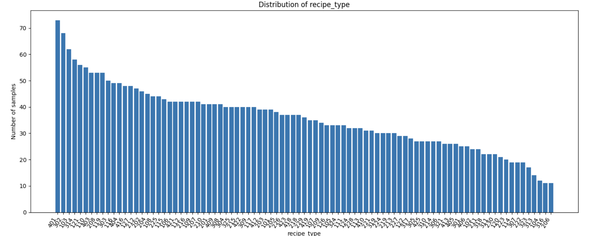
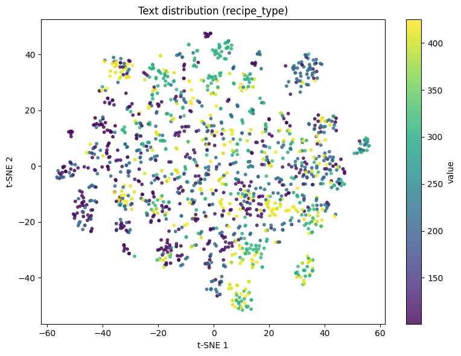
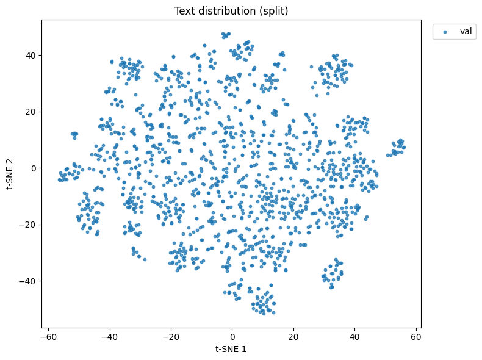
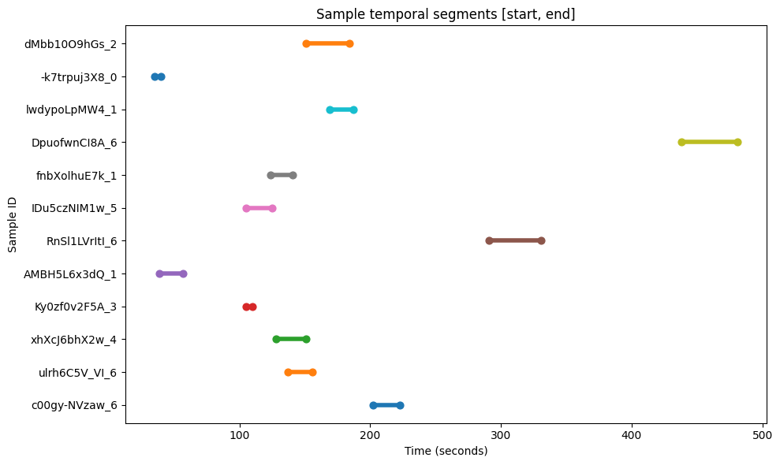

# Homework 1 - Data Preprocessing & Feature Extraction

*(aka Extracting Modalities from Cooking Videos to See If t-SNE Thinks Stir-Fry and Sautéing Are the Same Thing!)*

For this assignment, I worked with the YouCook2 dataset, a large collection of instructional cooking videos sourced from HuggingFace, to explore the full pipeline of preparing multimodal data for machine learning. 

I extracted three complementary modalities: video features (per-frame BGR color histograms and edge density), text embeddings (sentence-level semantic vectors via SentenceTransformer), and temporal features (segment timestamps). These were fused into a unified representation and visualized with t-SNE, then evaluated using accuracy and temporal IoU metrics.

[See python notebook here](homework/homework-1/homework-1.ipynb)

## Recipe Type Distribution
The YouCook2 dataset spans 89 distinct recipe categories. Visualizing the class distribution revealed meaningful imbalance, a consideration for any downstream training or evaluation strategy.

## t-SNE of Text Embeddings
Step-level descriptions were encoded using all-MiniLM-L6-v2 from SentenceTransformer. The resulting embeddings were projected to 2D with t-SNE to inspect semantic clustering, both by recipe type and also by data split.

 

## Sample Visualization: Segment Timelines

 A random sample of 12 clips was visualized along their temporal segment boundaries, showing the start and end times of each annotated cooking step within each video.

