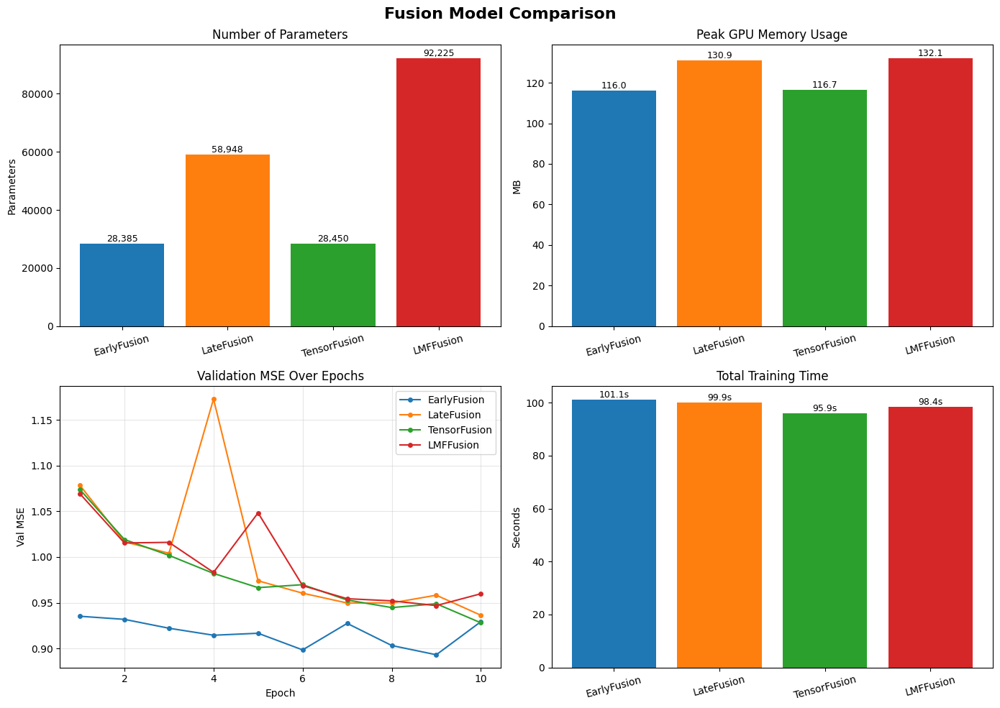
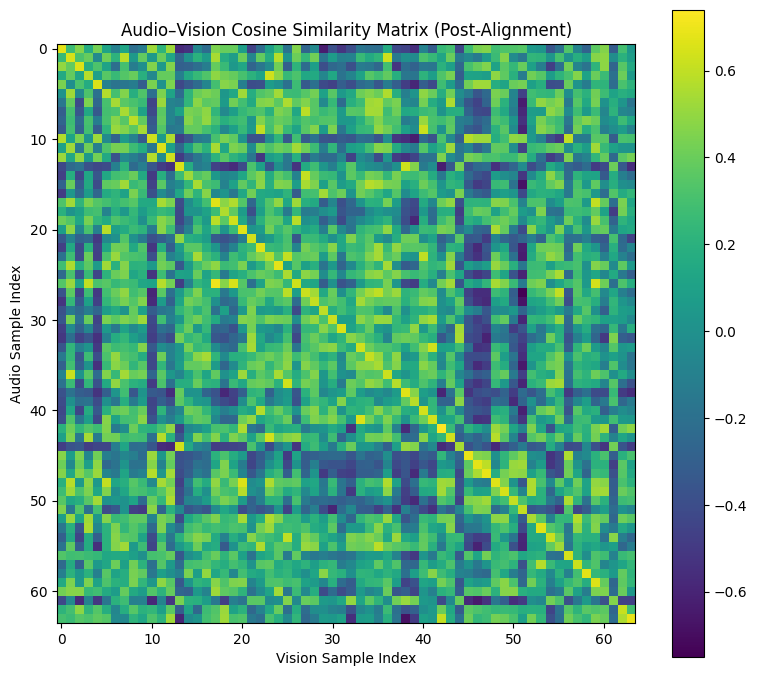

# Homework 2 - Multimodal Fusion & Alignment

*(aka Exploring Four Different Ways to Combine Someone's Face and Voice to Predict How Positive They're Feeling!)*

For this assignment, I worked with tensor operations and einsum notation, powerful tools that help speed up the process of coding machine learning architectures! 

I also trained unimodal audio and image classifiers on AV-MNIST as baselines. From there, I implemented four fusion strategies (early, late, tensor, and low-rank tensor) from scratch on the CMU-MOSEI sentiment dataset. The final section focused on contrastive learning: first using OpenAI's CLIP for zero-shot classification, then training a custom InfoNCE model to align audio and visual modalities into a shared embedding space.

[See python notebook here](homework/homework-2/homework-2.ipynb)

## Comparing Four Fusion Strategies

Using audio (COVAREP, 74-dim) and visual (OpenFace, 713-dim) features from CMU-MOSEI, I implemented early, late, tensor, and low-rank tensor (LMF) fusion from scratch in PyTorch using einsum notation. Early fusion edged out the others, though all four were within ~2% of each other.

Early Fusion — 65.74%
Late Fusion — 64.86%
Tensor Fusion — 63.89%
LMF Fusion — 63.76%

## CLIP Zero-Shot & Custom Alignment

I first used OpenAI's pretrained CLIP model to run zero-shot emotion classification on a test image, then trained a custom InfoNCE contrastive model to align CMU-MOSEI audio and visual features into a shared embedding space.

The similarity matrix below shows a clear diagonal, indicating the model learned to match each audio sample to its correct visual pair. The t-SNE confirms that aligned audio and visual embeddings cluster together in the shared space.

