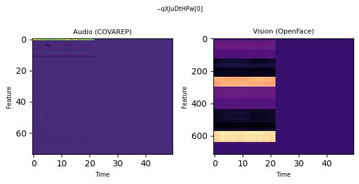

# Homework 3 - Multimodal LLMs

*(aka Fine-Tuning Qwen to Read Audio and Face Heatmaps and Guess If Someone's Having a Good Day!)*

Using the CMU-MOSEI dataset, I converted audio (COVAREP) and facial (OpenFace) features into side-by-side heatmap images and set up a sentiment classification task, asking the model to predict positive, negative, or neutral from each image. I ran baseline inference with the pretrained Qwen2.5-VL-3B-Instruct model, then experimented with prompt engineering strategies before applying LoRA fine-tuning and comparing pre- vs. post-training performance on held-out samples.

[See python notebook here](homework/homework-3/homework-3.ipynb)

### Converting Multimodal Features into Heatmap Images

Each CMU-MOSEI segment was rendered as a two-panel heatmap: audio features (COVAREP, 74-dim) on the left and facial features (OpenFace 2.0, 713-dim) on the right, both padded/truncated to 50 time steps. These images were saved as JPEGs with a corresponding sentiment label (positive / negative / neutral) for VLM training.

