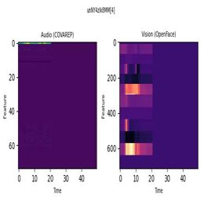
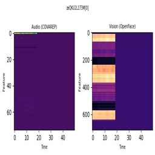

# Homework 4 - GRPO & VLMs

*(aka Teaching Qwen to Reason About Heatmaps by Rewarding Itself!)*

Building on the CMU-MOSEI heatmap dataset from HW3, I implemented Group Relative Policy Optimization (GRPO) to fine-tune Qwen3-VL-2B-Instruct for multimodal sentiment classification. This involved implementing the GRPO advantage computation from scratch, defining accuracy and format reward functions, training with LoRA, and comparing the resulting model against the SFT/LoRA approach from HW3.

[See python notebook here](homework/homework-4/homework-4.ipynb)

## GRPO: How It Works

GRPO removes the need for a separate critic network by using group-based advantage normalization: for each prompt, it samples G completions, computes the mean reward across the group, and uses the deviation from that mean as the advantage signal. This makes training more memory-efficient than PPO while still enabling relative comparison between outputs. The clipping term `clip(ρ, 1 − ε, 1 + ε)` keeps the policy from drifting too far from the reference model on any single update.

## Reward Functions

Two reward signals guided training:

- __`accuracy_reward`__: 1.0 if the extracted answer matches the ground truth sentiment label, 0.0 otherwise.
- __`format_reward`__: 1.0 if the completion contains an `Answer:` marker (ensuring the model produces a parseable output), 0.0 otherwise.

## Training Configuration

| Hyperparameter | GRPO | LoRA |
|---|---|---|
| Learning rate | 5e-6 | — |
| Training steps | 250 | — |
| Generations per prompt | 4 | — |
| Max tokens per completion | 512 | — |
| Epsilon (clipping) | 0.2 | — |
| Temperature | 0.7 | — |
| Beta (KL penalty) | 0.04 | — |
| Rank | — | 16 |
| Alpha | — | 32 |
| Dropout | — | 0.05 |

The format reward stabilized at 1.0 early on as the model quickly learned to include `Answer:` in its responses. Accuracy rewards started at 0.0 for the first ~30 steps, then began appearing as the model learned the correct output format, eventually reaching 1.0 on individual completions in later steps.

## Post-Training Evaluation

The GRPO-trained model was tested on held-out heatmap images and achieved **100% accuracy** on the test samples, correctly classifying both positive and neutral sentiments while providing step-by-step reasoning about what it observed in each modality.

> **Model output (positive sample):** "The audio heatmap shows low activation across most of the time, with some minor fluctuations near the beginning. The facial heatmap shows high activation in the upper features, particularly around the 10-second mark, suggesting a strong emotional expression. ... **Answer: positive** ✅"

> **Model output (neutral sample):** "The audio heatmap shows low activation across the feature space, indicating minimal activity in the audio features over time. The facial heatmap shows high variation in upper features, suggesting a range of facial expressions or movements. The combination of low audio activity and high facial variation suggests a neutral sentiment... **Answer: neutral** ✅"

## SFT vs. GRPO: Key Takeaways

SFT/LoRA from HW3 converged faster and produced better out-of-the-box accuracy for this 3-class classification task. GRPO spent much of its early training not receiving any reward because it struggled to produce the `Answer:` format, and its tendency to generate long reasoning chains caused it to hit the token limit (yielding 0% accuracy and no reward signal).

However, once the token issue was resolved, GRPO performed comparably to SFT and offered an added benefit: the model provides interpretable reasoning about which parts of the audio and facial heatmaps contributed to its classification. SFT is better suited for well-defined classification tasks; GRPO shines when the desired behavior is harder to quantify and reasoning quality matters.
